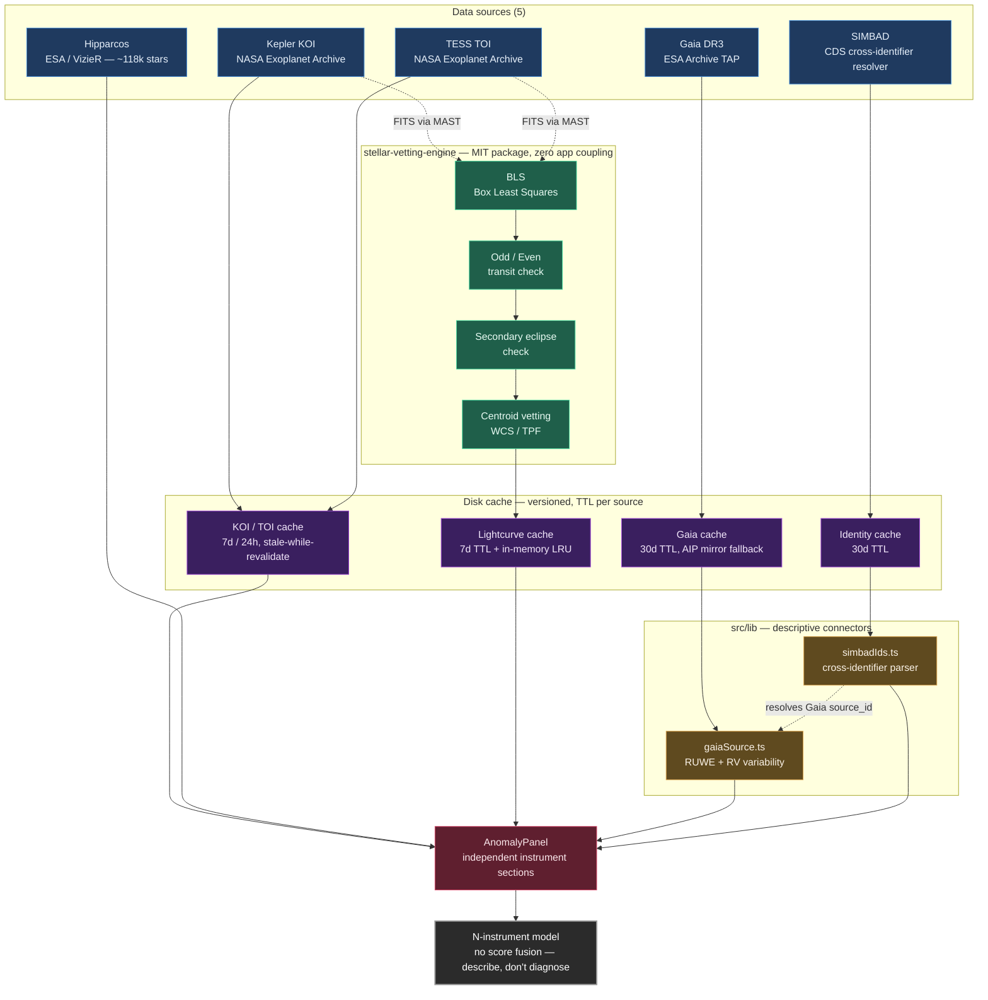

# Architecture overview

> This diagram is a snapshot of the architecture as of 2026-07-24 — see individual route/module files for current implementation details.

This is the full-project architecture overview: five external data
sources feed into the app through Next.js API routes, where the
MIT-licensed `stellar-vetting-engine` runs the detection pipeline (BLS →
odd/even → secondary eclipse → centroid) and the `src/lib` descriptive
connectors resolve Gaia and SIMBAD context. Every source is buffered by
its own versioned, TTL'd disk cache before reaching the UI. The
`AnomalyPanel` presents each source as an independent instrument section
under the project's N-instrument model — no score fusion, describe rather
than diagnose.

## Verified against the codebase (2026-07-24)

Every node and annotation in the diagram was checked against the real code:

- **Engine modules** — `bls.ts`, `oddEven.ts`, `secondaryEclipse.ts`,
  `centroidVet.ts` all live in `packages/stellar-vetting-engine/src/`
  (the MIT-licensed package, no app coupling).
- **Descriptive connectors** — `gaiaSource.ts` and `simbadIds.ts` are in
  `src/lib/`, deliberately outside the engine package (catalog-identifier
  and descriptive plumbing, not vetting science).
- **Cache TTLs** — KOI `7d`, TOI `24h`, lightcurve `7d` (+ an in-process
  `LruCache`), Gaia `30d` (with the ESAC→AIP mirror fallback), identity
  `30d`. All match the `DISK_CACHE_TTL_MS` constants in their routes.
