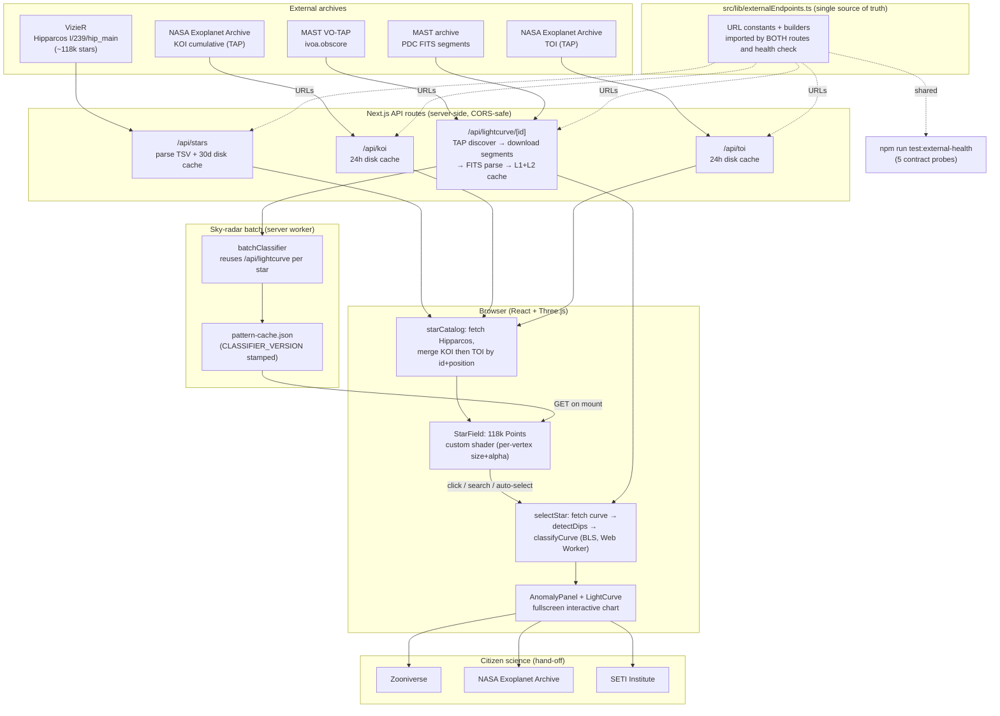

# Stellar Anomaly Explorer — Knowledge Base

Permanent record of **confirmed findings and design decisions**. This is
distinct from the other two docs:

- **README.md** — the pitch / how to run it (audience: newcomers).
- **CLAUDE.md** — operational quick-reference for day-to-day work
  (audience: whoever is editing the code next, human or AI).
- **KNOWLEDGE_BASE.md** (this file) — the *why*: investigations that
  concluded, incidents and their root causes, methodology choices, and
  open issues we understand but haven't fixed. Things that would
  otherwise be re-derived from scratch.

Entries are written to survive: each states what was concluded, how it
was confirmed, and — where relevant — what remains uncertain. Dates are
absolute.

---

## 1. Classifier methodology

### 1.1 Describe, don't diagnose (the hard rule)

The light-curve classifier (`lib/curveClassifier.ts`) and every UI
surface that consumes it are **strictly descriptive**. No string is
allowed to assert a physical cause — no "planet", "binary", "eclipse",
"alien megastructure", "Dyson sphere". The classifier MEASURES features
of the data (periodicity, depth consistency, dip shape, baseline RMS);
the user interprets. The IRREGULAR label's copy is deliberately framed
as a prompt ("worth a closer look"), not a conclusion.

Why this is a rule and not a preference:
- The app reports to citizen-science platforms (Zooniverse, NASA, SETI).
  A tool that whispers "planet" to a volunteer poisons the very data
  those platforms exist to collect. The scientific value is in the
  human making the call on real data — the app's job is to route
  attention, not to pre-judge.
- It keeps us honest about what the measurement can actually support. A
  periodic dip pattern is a *measurement*; "transiting planet" is an
  *inference* that requires ruling out eclipsing binaries, star spots,
  instrumental effects, etc. (See §5, the TPF centroid future feature,
  for the first-order false-positive test we deliberately do NOT yet
  run.)

### 1.2 Plausibility guards (v1) → and why they were replaced

Classifier **v1** used an interval-folding heuristic to detect
periodicity: take consecutive dip-to-dip intervals, fold, score by the
residual. This produced two failure modes that needed guards:
- **Cadence lock-on**: the dip detector could lock onto the observation
  cadence itself and report a spuriously perfect "period" equal to a
  small multiple of the sampling interval. v1 guarded this with an
  *implausible-period* floor and a *dip-density* ceiling.
- **Deep-transit swallowing**: the plausibility guards were tuned
  conservatively and ended up **suppressing real periodic signals** on
  deep-transit stars — labeling genuinely periodic transiting systems
  UNCERTAIN because the raw scalars looked "too clean to be real."

### 1.3 Why BLS was added (classifier v2, 2026-07-04)

A budgeted, dependency-free **Box Least Squares** search (`lib/bls.ts`)
replaced the interval-folding gate. BLS is the standard transit-search
algorithm: it slides a box (in-transit / out-of-transit) across a
log-spaced period grid and maximizes the signal residue, yielding an
SDE (Signal Detection Efficiency) statistic. `BLS_SDE_THRESHOLD = 7.5`
is the confidence bar.

A real phase-folding search inherently rejects cadence lock-on (a
cadence artifact doesn't fold coherently across the whole baseline), so
the v1 implausible-period and dip-density guards were **removed** — BLS
subsumes them. The pattern-label priority became:

1. `HIGH_VARIABILITY` if baseline RMS ≥ 1% (even over a confident BLS
   hit — the BLS line still shows separately).
2. `SPARSE` if fewer than 3 visible dips. **Deliberate gate**:
   PERIODIC_UNIFORM's copy describes the VISIBLE dip pattern, so a
   confident BLS signal with 0–2 visible dips must NOT promote — that
   would make the label describe something the user can't verify by
   looking at the curve. (This is the describe-don't-diagnose rule
   expressed as code. See §4.4 for the K00931.01 consequence.)
3. `PERIODIC_UNIFORM` if BLS found a confident signal.
4. `UNCERTAIN` if the raw scalars look periodic but BLS found nothing
   confident (the signature of the detector locking onto flicker).
5. `IRREGULAR` otherwise.

`CLASSIFIER_VERSION` is bumped on any change that can alter labels;
pattern-cache entries record it and the batch treats old-version
entries as missing (re-classifies).

---

## 2. BLS v2 rollout results

### 2.1 The re-batch (2026-07)

After landing BLS v2, the whole ~9k-star KOI+TOI population was
re-classified (the sky-radar batch). The run completed **10,931/10,931
processed, 0 errors, 8,769 v2 pattern-cache entries** (plus 6 legacy
pre-versioning TIC entries that a future batch will refresh — see the
note in §4 on cache versioning).

Pattern distribution shift, v1 → v2:

| Pattern           |   v1 |   v2 |      Δ |
|-------------------|-----:|-----:|-------:|
| SPARSE            | 4336 | 4331 |     −5 |
| UNCERTAIN         | 3164 | 2032 | −1,132 |
| IRREGULAR         |  522 |  370 |   −152 |
| HIGH_VARIABILITY  |  416 |  416 |      0 |
| PERIODIC_UNIFORM  |  336 | 1620 | +1,284 |

The headline: **PERIODIC_UNIFORM nearly 5×'d (+1,284)** while UNCERTAIN
fell by ~1,132. The BLS search is promoting the periodic signals that
v1's plausibility guards were swallowing (§1.2). Of the deep-transit
population (NASA depth ≥ 10,000 ppm), 783 of 1,592 classified stars now
carry PERIODIC_UNIFORM. (We cannot report the exact *previously-
UNCERTAIN → now-PERIODIC* transition count because the v1 per-star
labels were overwritten by the batch; the aggregate movement is the
evidence, and it's consistent with the deep-transit hypothesis.)

### 2.2 The K02357.02 sibling-planet validation (surprise from the
unit-test session)

While freezing regression fixtures, K02357.02 (KIC7449554) produced a
result that at first looked like a bug and turned out to be a
validation:

- The star shows **1 visible dip** in the rendered curve → the local
  detector labels it **SPARSE**.
- But **BLS finds a confident signal at P = 2.4210 d** (157 ppm),
  matching NASA's catalog period for the SIBLING planet **K02357.01**
  to ~5×10⁻⁵ relative.

So BLS recovered a real second planet's signal that is below the visual
noise band of the rendered curve — the classifier is genuinely more
sensitive than eyeballing. Critically, the star **stays SPARSE** (the
< 3-visible-dip gate holds), so the label still honestly describes what
the user can see, while the BLS line reports the statistical detection
separately. This is the describe-don't-diagnose gate and the BLS
sensitivity BOTH working, on the same star, at the same time. It is now
pinned as a regression fixture.

---

## 3. Data integrity findings

### 3.1 NASA vetting vs. local 1% detector are different instruments
(the score/detector "desync")

A recurring confusion: a star can carry a high catalog `anomalyScore`
(derived from NASA's KOI/TOI vetting — disposition, depth, score) yet
show **no dip** the local detector flags, because the two are
**different instruments measuring different things**, and they are
**not merged by design**:

- NASA's disposition reflects the full vetting pipeline (pixel-level
  centroid tests, multi-quarter folding, ephemeris matching, human
  review) applied to a specific planet candidate's transit.
- The local detector (`detectDips`, threshold 0.990) is a simple
  depth/consistency pass over the rendered full-mission flux at a **1%
  dip threshold**. A 0.5%-depth 4-hour transit spans ~8 samples out of
  ~60k and is, correctly, below its threshold.

They answer different questions ("has NASA's pipeline vetted a candidate
here?" vs. "is there a ≥1% dip in this rendered curve?"). Keeping them
separate — and letting the classifier's BLS line bridge them
statistically when it can (§2.2) — is intentional. The `anomalyScore`
drives attention/markers; the detector drives the per-star dip readout.

**Prior art (for context, not a claim of parity):** the Planet Hunters
TESS team's **"NotPlaNET"** work (a machine-learning false-positive
filter layered on volunteer classifications) addresses the same *class*
of problem — reconciling a sensitive-but-noisy detector against a
vetting instrument, and deciding what to surface to a human. We are NOT
claiming to have solved what they solved; we do far less. The parallel
is noted only to place our score-vs-detector separation in the lineage
of "detector output ≠ vetted disposition" problems that established
citizen-science pipelines also grapple with.

### 3.2 Lightcurve cache staleness (K02357.02 depth drift) — FIXED

**Incident (2026-06/07):** the lightcurve disk cache has a 7-day TTL.
The route was edited multiple times during a dev period while old
entries kept being served. K02357.02's dip measured **1.08% deep from a
stale entry vs 1.00% from a fresh fetch** of the same star (same reader
code, different write-time pipeline). Leave-one-quarter-out testing
ruled out MAST segment availability as the cause (it moves depth
≤ 0.0001 pp) — the remaining explanation was mixed-provenance cached
data written by different code iterations.

**Fix:** `CACHE_SCHEMA_VERSION` on every L2 entry. An entry whose version
≠ the current constant (including pre-versioning entries with none) is
treated as a MISS and refetched, never served. The constant is bumped
whenever the fetch pipeline changes in a way that can alter the arrays.
This eliminates mixed-provenance data as a class.

### 3.3 Hipparcos synthetic-fallback incident (VizieR contract drift) —
FIXED, and now guarded

**Incident (discovered 2026-07-04 audit):** the app had been silently
serving the **synthetic** star fallback for an unknown period. Two
independent VizieR contract changes caused it:
- The `/viz-bin/TSV` endpoint path started returning 404 (VizieR moved
  it to `/viz-bin/asu-tsv`).
- The requested `RArad`/`DErad` position columns stopped being honored;
  VizieR **silently drops unknown requested columns**, and the old
  positional parser turned that into garbage coordinates.

Both failed *silently* because the route fell back to
`KNOWN_ANOMALIES` + client synthetic padding without a loud signal.

**Fixes:**
- Endpoint corrected to `/viz-bin/asu-tsv`; columns switched to the
  catalog-native `RAICRS`/`DEICRS` and located **BY NAME** from the
  header (a missing required column now **throws** — contract-change
  detection, not garbage coordinates).
- Fallback now logs **loudly** (`[stars] VizieR fetch FAILED`).
- **`npm run test:external-health`** (added 2026-07-05) probes all five
  external dependencies against the *exact* shared endpoint constants
  (`lib/externalEndpoints.ts`) the routes use, verifying the CONTRACT
  (required columns present, TOI `tid` column, MAST returns FITS), not
  just reachability. This is the standing guard against silent
  contract drift of exactly this kind.

**Live note (2026-07-05):** the health check immediately earned its
keep — it caught a real, ongoing VizieR-side outage of the Hipparcos
`I/239/hip_main` table (backend DB "not currently reachable", then a
table-specific empty-response state while other VizieR catalogs served
data normally). The check correctly distinguishes this "upstream
service degraded" condition from a column-contract change. This is an
EXTERNAL outage, not an app bug; the route falls back cleanly and the
30-day disk cache will serve real data once VizieR recovers.

---

## 4. K00931.01 (KIC9166862) — **NOT a resolved case; actively
investigated**

This one must be stated precisely, because it is easy to over-summarize
as "fixed."

**What IS confirmed:** the BLS engine computes K00931.01's period
correctly. In the frozen regression fixture (full-mission curve, 351
dips) it labels PERIODIC_UNIFORM at **P ≈ 3.85563 d** vs NASA's
**3.855603916 d** — agreement to ~6 significant figures. The classifier
math is right and pinned by the test.

**What is NOT resolved:** the **live single-star view's displayed label
depends on how many quarters MAST serves at fetch time**, and that is
currently *not always complete*. On 2026-07-05, a live on-demand fetch
of K00931.01 returned only **2 of 17 available quarters (8,023 of ~65k
samples)**, yielding **1 detected dip** → the SPARSE gate fires → the
live view shows **SPARSE with no displayed period**, even though BLS on
that same truncated data still finds the correct 3.8555 d signal (SDE
16.6). So the fixture passes while the live app can show a different,
"downgraded" label for the same star.

**Root cause of the truncation (confirmed 2026-07-05, cross-referenced
to §4.5):** it is NOT a MAST availability problem and NOT a difference
between the batch and on-demand request paths (both call the same
`/api/lightcurve` route with identical query params). The cause is in
the route's **segment-download stage**: it downloads all N quarter FITS
files with unbounded `Promise.all` parallelism, and `archive.stsci.edu`
/ the undici connection pool **drops a random subset of simultaneous
connections** (bare `TypeError: fetch failed`, connection-level, no HTTP
status). The route silently drops failed segments and only bails if ALL
fail, so it caches a **random partial curve**.

Measured on kplr009166862 (17 quarters available at MAST *right now*):

| Download strategy      | Segments recovered |
|------------------------|--------------------|
| Sequential (1 at a time) | **17 / 17** (every trial) |
| Concurrency 3          | 12 / 17 |
| Concurrency 5          | 6 / 17 |
| Full parallel (17)     | 2–5 / 17 (random each run) |

The failure rate scales directly with concurrency. The famous 2-quarter
cache entry was just a bad parallel-download roll that got latched into
the in-process (L1) and disk (L2) caches. (The earlier "forced cold
re-fetch" that appeared to reproduce the 2-quarter result was actually
defeated by the L1 in-process cache serving the stale result in 0.3s.)

**Widespread, not one star:** sampled PERIODIC_UNIFORM KIC stars have
cached segment counts ranging from 2 to 18. KIC11414511 has 2 cached
but **17 available** at MAST — same truncation.

**Status: OPEN.** A fix has been diagnosed but deliberately NOT
implemented pending review, because the right fix depends on the design
call: bounded-concurrency download pool (sequential recovered 100%),
retry on `fetch failed`, a minimum-quarter threshold before caching, or
surfacing "partial data (N/M quarters)" to the user — or some
combination. Tracked in §7.

---

## 5. Known visual / UX bugs — FIXED

These are recorded because each was subtle and the wrong fix was tried
first; the reasoning is worth keeping.

### 5.1 Raycast disambiguation popover filter (dense-field over-listing)

**Symptom:** clicking in a dense KOI/TOI cluster opened a
disambiguation popover listing 20–30 "candidates" up to ~27 arcmin from
the cursor, all reading 0.0px distance.

**Root cause:** the code projected `intersection.point` to screen space
to compute click distance. For `THREE.Points`, raycasting sets
`intersection.point` to the closest point ON THE RAY, not the star's
position — so it projected back onto the click pixel for *every* hit,
and the 6px screen filter passed everything inside the much wider
world-space raycaster threshold.

**Fix:** project the STAR'S OWN world position (read from the geometry
buffer at `hit.index`), then filter to `CLICK_DISAMBIG_RADIUS_PX = 6`.
Measured on a fixed 16-click grid at FOV ≈ 24°: before = popovers with
5–30 candidates (mean 15.6); after = 2–4 candidates, most clicks
direct-select.

### 5.2 Panel z-index occlusion ("clicking a flagged star does nothing")

**Symptom:** clicking a row in the bottom-right FLAGGED list did
nothing while the AnomalyPanel was open.

**Root cause:** the AnomalyPanel is a 300px right-edge column at
z-index 20; the HUD (with the flagged list) is z-index 10 at
`right: 24`. With the panel open, every bottom-right HUD element
rendered UNDERNEATH it — invisible, and clicks aimed at the flagged
rows silently hit the panel instead. The data path was never at fault.

**Fix:** while a star is selected, the bottom-right HUD column AND the
minimap shift left to `right: PANEL_CLEARANCE_RIGHT = 324` (0.25s ease)
so they clear the open panel.

### 5.3 Selection race conditions (star A's header + star B's curve)

**Symptom:** two rapid selections (or an explicit pick immediately
followed by an auto-select) could pair one star's panel header with a
different star's light curve, because whichever MAST fetch resolved LAST
won the store — and the cold path can take ~60s.

**Fix:** `selectStarAndFetchCurve` claims a module-level
`selectionGeneration` counter at entry; after its `fetchLightcurve`
await resolves, it only writes lightcurve/anomaly state (and only clears
the loading flag) if it is STILL the latest generation. The classifier
await re-checks the same generation. Synchronous pre-fetch writes stay
unguarded (the latest call always runs them last). Pinned by a unit test
that stubs `fetch` with manually-ordered deferred responses for both
stale orderings.

A related fix in the same area: the CameraSync **auto-select transition
guard** (`centeredAnomalyRef`) only fires auto-select when the centered
anomaly's id CHANGES frame-to-frame, so an explicit off-center pick
survives; plus a ~1.3s **fly-to suppression window** so a mid-tween
centered-star change doesn't steal a just-completed search pick.

---

## 6. Comparison to prior art (Zooniverse / Planet Hunters TESS)

This app is an **exploration and triage front-end**, not a
classification pipeline or a discovery platform. Being explicit about
the differences keeps us from overclaiming:

- **Planet Hunters / Planet Hunters TESS (Zooniverse)** collect
  volunteer transit classifications at scale and feed them into vetting
  pipelines; their "NotPlaNET" ML filter reduces the false-positive
  load on volunteers (see §3.1). They produce *science-grade candidate
  lists* reviewed by professional teams.
- **This app** does not collect classifications, does not train models,
  and does not vet candidates. It renders real Hipparcos/Kepler/TESS
  data, routes attention toward anomalies via a **descriptive**
  classifier (§1), lets a user inspect a real light curve, and hands
  off to the established platforms (Zooniverse, NASA Exoplanet Archive,
  SETI) for actual reporting. The BLS line and the sky radar are
  attention-routing aids, not verdicts.

Where we DO overlap conceptually is the detector-vs-vetting reconciliation
(§3.1) — a problem those platforms also face — but our handling is a
deliberate *separation* (show both, merge neither), not a solution to
their harder problem.

---

## 7. Known open issues — NOT yet fixed

### 7.1 MAST quarter-availability inconsistency (partial light curves)

Fully diagnosed in §4: the `/api/lightcurve` route downloads all
segments with unbounded parallelism, and `archive.stsci.edu` drops a
random subset under concurrency, so on-demand single-star fetches cache
**random partial curves** (2/17 to full). This makes the live label for
deep-transit stars fetch-dependent (K00931.01 shows SPARSE live despite
being PERIODIC_UNIFORM with the full curve). **Fix diagnosed, held for
design review** — candidate approaches: bounded-concurrency download
pool (sequential recovered 100% in testing), retry on `fetch failed`,
minimum-quarter threshold before caching, and/or surfacing "partial
data (N/M quarters)" in the UI.

### 7.2 TOI 5523.02 — chart renders as solid blocks (12,431 dips)

**FIXED 2026-07-07** (same day as the root-cause below). Fix: (1) a
sigma-relative threshold floor — when `robustFluxSigma` (1.4826×MAD)
exceeds `DIP_NOISE_GATE_SIGMA = 0.0075`, the in-dip cut becomes
`min(0.990, 1 − 3σ_rob)`; the gate sits between the noisiest calibrated
Kepler fixture (K01725.01, σ_rob 0.575%) and this star (1.43%), chosen
by a measured sweep that showed the UNGATED form drifts two Kepler
fixtures (K01725.01 53→0, K01317.01 461→411) — the gate preserves all 7
bit-identically. (2) Fragmentation merge (`DIP_MERGE_GAP_DAYS = 0.01`)
and (3) min duration (`MIN_DIP_DURATION_DAYS = 0.02`) — both structural
no-ops at Kepler's 30-min cadence, active at TESS 2-min. Result:
TOI 5523.02 = 12,431 → **20 dips** (≥3σ sustained excursions, deepest
8.5%), frozen as the 8th regression fixture; the dip-marker blocks in
the chart are gone (the white per-sector noise envelope remains — that
part is a faithful rendering of σ=1.6% data, per the diagnosis).
`CLASSIFIER_VERSION` bumped 2→3 (dip count feeds the SPARSE gate, so
high-noise stars' labels can change); the pattern cache needs a
re-batch to refresh v2 entries. Original diagnosis kept below.

**v3 re-batch completed 2026-07-08**: 10,931/10,931 processed, 0
errors, 8,759 v3 entries (18 stragglers kept at old versions — their
refetch returned no-data/partial; next batch retries). Distribution
v2 → v3: SPARSE 4,331→5,785 (+1,454), UNCERTAIN 2,032→904 (−1,128),
PERIODIC_UNIFORM 1,620→1,172 (−448), IRREGULAR 370→612 (+242),
HIGH_VARIABILITY 416→286 (−130). Direction matches the fix: noise
dips vanish, so flicker-driven UNCERTAIN collapses into SPARSE, and
PERIODIC_UNIFORM promotions that rested on noise "visible dips" drop
to SPARSE (their BLS line still shows). Caveat: the v2 batch ran on
potentially-truncated pre-concurrency-fix curves while v3 ran on
complete ones, so the shift conflates detector calibration with data
completeness — not decomposable without a per-star diff, which the
overwritten v2 labels no longer allow. Operational note: the batch
run surfaced that Next dev auto-restarts on a memory threshold
(~every 4k stars — the lightcurve L1 Map grows unboundedly under
batch load); a 5-min watchdog that re-POSTs on worker death carried
the run to completion across two auto-restarts. The unbounded L1
was FIXED 2026-07-08: it is now a 40-entry LRU (`lib/lruCache.ts`),
bounding L1 at ~80 MB worst-case while keeping the on-demand
repeated-access benefit.

**Root-caused 2026-07-07**. The original CVZ
hypothesis was WRONG: TIC 443616612 is an ordinary 5-sector TESS
target near the ecliptic (Dec −3.98°), 78,198 samples at 2-min
cadence, fetched complete (5/5). Measured diagnosis:

- **Detector: out-of-domain calibration, not a code bug.** The star's
  photometric scatter is σ ≈ 1.6% (Tmag 13.77 at 2-min cadence), so
  the fixed `threshold = 0.990` sits at **0.6σ below the mean** —
  24.3% of ALL samples qualify as "in a dip". With no minimum
  duration and no merging, the noise tail fragments into 12,431
  contiguous runs: 70% are single-sample (one 2-min point), 63%
  start within ≤3 samples of the previous dip's end. On Kepler PDC
  (σ ~0.1–0.3%) the same threshold is 3–10σ, which is why it worked.
  The count is the detector doing exactly what it's coded to do on
  input outside its calibration domain. Fix direction: noise-relative
  (sigma-aware) threshold, and/or minimum-duration + adjacent-run
  merging — the dip-count analog of the implausible-period guard.
- **Chart blocks: two compounding effects, both renderer-faithful.**
  (1) The 5 sectors cover ~109 observed days spread across a
  1,003-day x-span, so all data (and all 12,431 markers) pile into
  ~11% of the canvas columns — ~71 dip markers per occupied column →
  solid cyan/orange/white blocks (NOTABLE 5,320 / INTERESTING 994 /
  NORMAL 6,116 dots stacked). (2) Mean per-column flux peak-to-peak
  is 8.69% vs a p1–p99 y-range of 8.24% — every occupied column's
  samples span the FULL y-range, so even perfect LTTB + per-column
  dedupe (which deliberately keeps the extremes) strokes a
  full-height vertical line per column. The white band is a faithful
  rendering of a 1.6%-σ noise band; the colored blocks are the
  12,431 dip markers. No renderer algorithm failure (detectDips runs
  in 19 ms; classifyCurve in 526 ms).
- **Classifier + vetting checks degrade gracefully.** baselineRMS
  1.18% → HIGH_VARIABILITY (correct, priority rule 1: "dips here are
  hard to trust"). BLS finds no confident signal (SDE 3.5 — red-noise
  suppression, documented) → odd/even and secondary-eclipse checks
  correctly return null. The known planet (P=3.47 d, 4,280 ppm) is
  genuinely below detectability under this noise. The side panel
  slices to 6 dip cards, so only the "DIPS DETECTED (12,431)" counter
  and the canvas markers surface the pathology to the user.

### 7.3 TOI score cap asymmetry (KOI vs TOI scoring scale)

`scoreFromToi` = `min(depth/20000, 0.3) + (CP||KP ? 0.2 : 0)`, so a TOI
tops out around 0.5 in practice (deep + confirmed), whereas
`scoreFromKoi` adds `koi.score * 0.5` on top of the same depth+
confirmation terms and can reach 1.0. TOI has no `koi.score` equivalent
(TAP doesn't carry a comparable per-object score), so the TOI base term
was dropped — but the consequence is that **TESS anomalies systematically
score lower than Kepler ones** and rank below them in score-sorted
views (NEXT ANOMALY, flagged list). This is a scoring-scale asymmetry,
not a bug per se, but it means the two missions' scores are not directly
comparable. Open question whether to renormalize TOI onto the KOI scale
or accept the asymmetry.

---

## 8. Current data pipeline (Mermaid)

---

*Last updated 2026-07-07. When an open issue in §7 is fixed, move it to
the relevant "FIXED" section with its root cause, and update the K00931.01
entry (§4) once §7.1 is resolved.*
